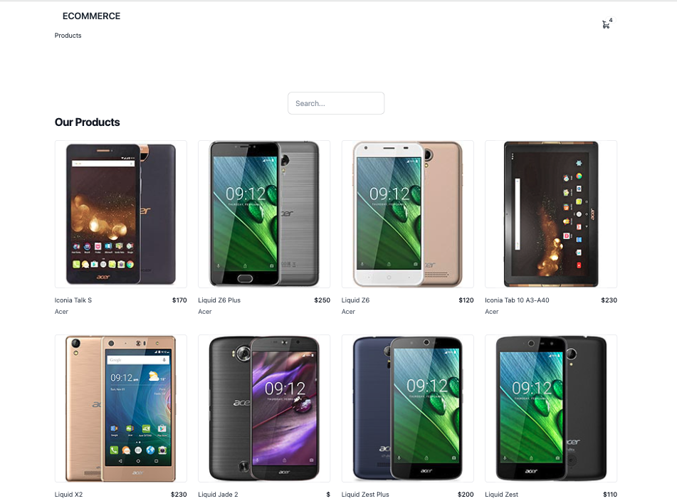

# Mobile Ecommerce

<div>
  <p align="center">
    
  </p>
</div>

## Overview

In the image, we can see the expected result of the app when it is correctly installed. The image showcases the user interface of the app, displaying various components and interactions.

The ecommerce app allows users to browse and purchase mobile devices. It features a Product List Page and a Product Details Page. Users can filter products and view detailed information. The app utilizes React and integrates with a RESTful API for data retrieval and cart management. It provides a user-friendly interface for seamless mobile device shopping.

## Getting Started

### Prerequisites

- npm

### Installation

1. Clone the repository:

   ```sh
     git clone git@github.com:JoaquinBuxo/ecommerce-react.git
   ```

2. Install dependencies:

- ecommerce : `cd ecommerce-react`

  ```sh
  npm install
  ```

3. Setup and start the app:

   ```sh
   npm start
   ```

4. Run Lint:

   ```sh
   npm run lint
   ```

5. Build:

   ```sh
   npm run build
   ```
